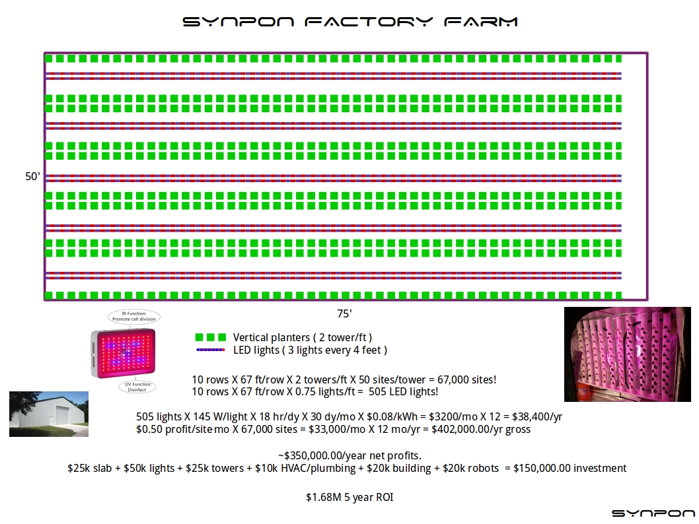

# Factory Farm

I want to buy a lot of land somewhere to build a 50' X 75' X 20' metal building
to build a factory farm.

I want to eventually make my own LEDs, but until then I will probably buy GalaxyHydro
lights on [Amazon.com](http://amazon.com).

I would love the grow cannabis commercially, but if that isn't in the cards there is a lot of money to be made growing Holy Basil and other fruits and vegetables. Especially items that aren't readily available year round as indoor gardens have no growing season.

I want to have robot arms with contact sensing humanoid hands on scissor lift bases roaming the (very limited) floor space of the operation clipping, pruning, spraying, and eventually harvesting the plants growing vertically in the indoor space.
