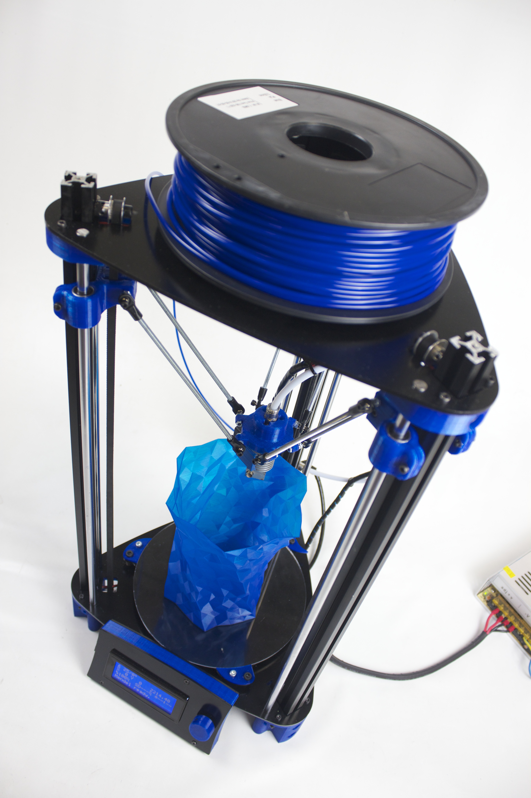
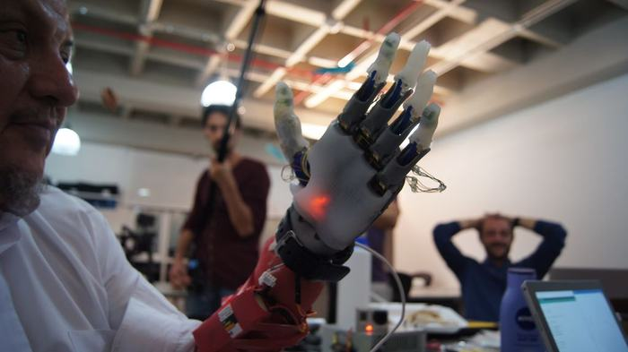
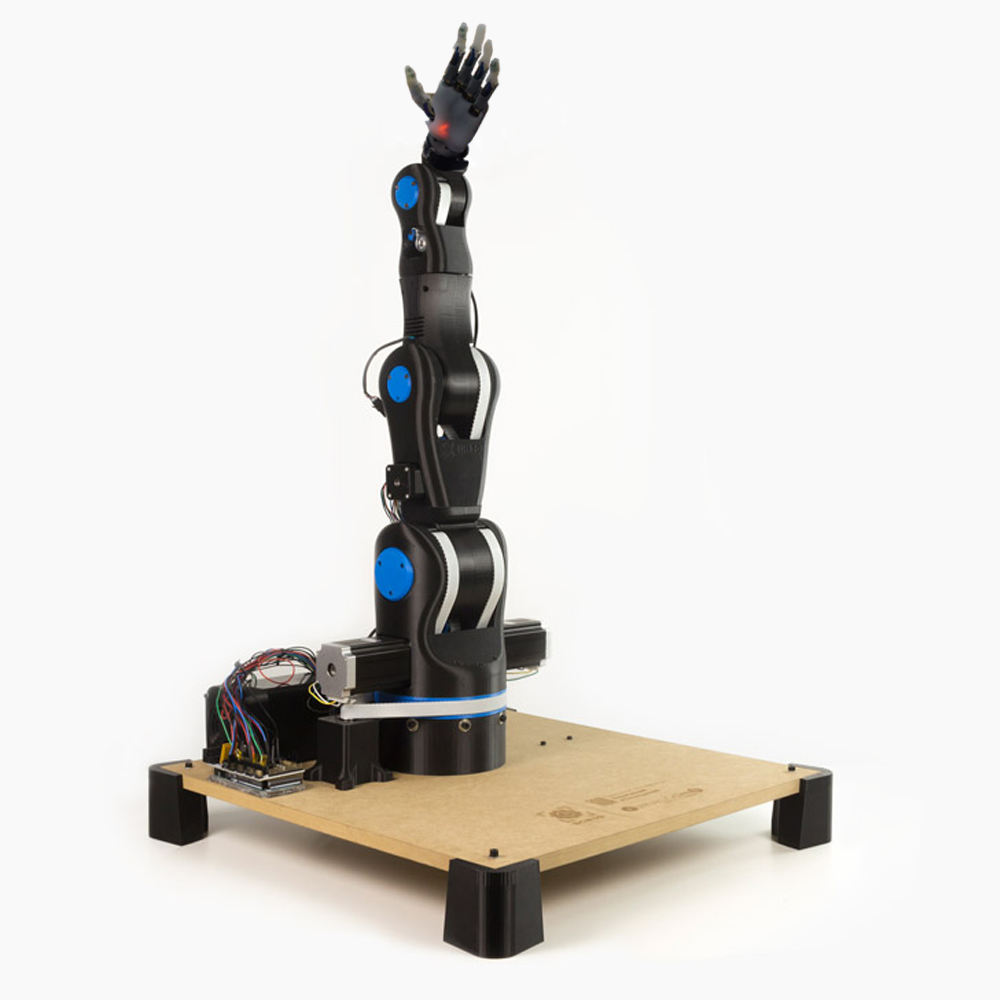

# Open Source Manipulator

I am going to buy a 3D printer kit for less than $700 from [BCN3DTechnologies](BCN3DTechnologies.com).

I need a large 3D printer so I can print the parts for the [Moveo](https://github.com/BCN3D/BCN3D-Moveo), seen below.
.

It might only use stepper motors at the present, but I'm sure that I would be better equipped to build a more serious robot arm for use in precision industrial manufacturing where such high repeatability is needed after having built this arm. I can upgrade the design with better servos after I build my first attempt.

After I get the arm built, I am going to build another one, perhaps with some harmonic drive motors and elongated links, perhaps not, but with a [compliant prosthetic hand](https://www.wevolver.com/kyung.yun/compliant-prosthetic-hand) on the end.

So I want to add two open source hardware projects in robotics on top of each other. I predict the final result will look a lot like this.

192.30.252.153
192.30.252.154
